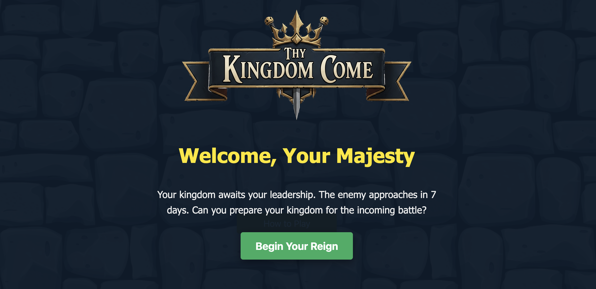

# Thy Kingdom Come

## Description

***Thy Kingdom Come*** is a resource-management strategy game where you take on the role of a king who is preparing for a looming invasion. With only 7 days to prepare, every decision matters. Will you raise a mighty army, fortify your walls, or ensure your people are prosperous and happy? The fate of your kingdom is in your hands.

This project was inspired by a love for resource-management board games and choose-your-own-adventure stories, where every choice has a meaningful consequence on the outcome.

## How to Play

*   **Goal:** Survive 7 days and build a **Power Level (Military + Structure)** of at least 100 to defeat the enemy.
*   **Actions:** Each day has three phases (Morning, Afternoon, and Evening). You can perform **one action** per phase.
*   **Resources:** Manage your **Treasury** to fund actions. Keep **Popularity** high to avoid a revolt. Balance **Food** and **Culture** to keep your people happy and even gain a popularity bonus.
*   **Losing:** You can lose in two ways: having your Power Level be too low at the end of 7 days, or if your Popularity drops to zero at any point.

## Technologies Used

- HTML5
- CSS3
- JavaScript
- Git / GitHub

## Credits & External Sources

- **Audio:** Sound effects and music were sourced from various creators on royalty-free audio websites.
- **Images:** Logo and images were created using the AI generator tool Gemini and Microsoft Designer.
- **Inspiration:** The game mechanics were inspired by classic board games and interactive fiction, focusing on resource management and strategic decision-making.

## Next Steps

Future features and improvements could include:

- **Random Events:** Introduce random events at the end of each day that can positively or negatively impact the kingdom's stats, adding unpredictability and replayability.
- **Advisor System:** Add advisors who offer suggestions or warnings based on the current state of the kingdom, providing more narrative depth.
- **Expanded Tech Tree:** Allow for more complex upgrades, such as unlocking new unit types or building structures that provide passive bonuses.
- **Animated Graphics:** Enhance the visual experience with animations for actions, transitions, and events to make the game more engaging.

---

### Game Screenshots

