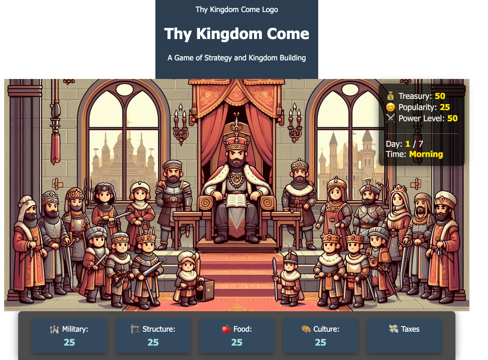
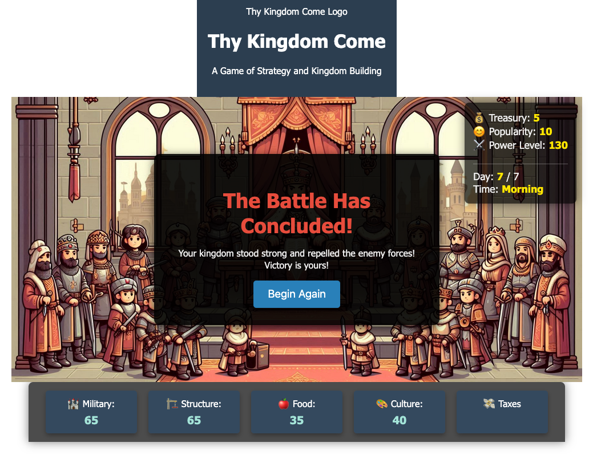

# Thy Kingdom Come
<!-- still a work in progress!!! -->

## User Stories
* As a user, I want to see a welcome message with a button to begin the game.
* As a user I want to see buttons to perform actions like collecting taxes, building structures, and recruiting soldiers.
* As a user, I want to see an end of day screen that shows the current day and a button to continue to the next day.
* As a user, I want to see a stats panel that displays my kingdom's resources.
* As a user, I want to see a time panel that displays the current day and the number of days until the enemy arrives.
* As a user, I want to see a message box that displays messages during the game.
* As a user, I want to see a stats and time panel that displays my kingdom's resources and the current day.
* As a user, I want to see a game over screen that displays the outcome of the game and a button to replay.
* As a user, I want to see a logo and title at the top of the game screen.
* As a user, I want to see a subtitle that describes the game.
* As a user, I want to see a background image that sets the theme of the game.

## Description

***Thy Kingdom Come*** is a strategy game where players manage resources, build structures, and prepare their kingdom for an impending enemy attack. Players must make strategic decisions to ensure the survival and prosperity of their kingdom within a limited timeframe.

## Technologies Used
- HTML
- CSS
- JavaScript
- Git
- GitHub
- Visual Studio Code
- Web Browser (for testing and running the game)

